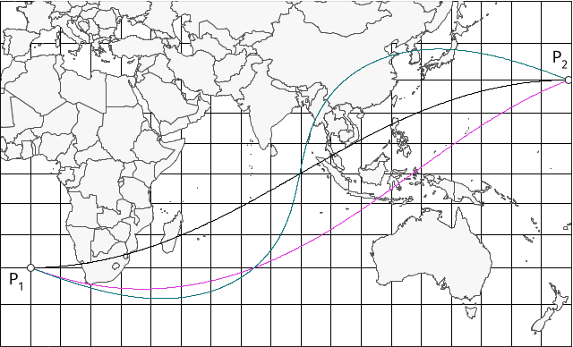

# Curva de Alineación

La curva de alineación representa, en forma ideal, la trayectoria del eje de colimación de un teodolito. A diferencia de las secciones normales y centrales, la curva de alineación no es plana sino que tiene torsión, lo que impide soluciones analíticas directas para los problemas geodésicos directo e inverso. En "curvas.py" se implementan las fórmulas de la curva a partir de su función implícita y sus derivadas, formulando sistemas de ecuaciones diferenciales ordinarias para el cálculo de acimut, longitud y área. El problema inverso se resuelve eficientemente mediante integración numérica con el método de Dormand-Prince. El problema directo requiere un esquema iterativo de Newton-Raphson bivariado con derivadas numéricas, resultando computacionalmente costoso. Además no es una implementación robusta y debe ser siempre comprobado con el problema inverso. Esta forma de resolverlo se extiende a los casos de la sección normal primera y la sección central.
La curvas suelen ser similares excepto cuando los puntos terminales están cerca de ser antipodales. En este ejemplo se representan las curvas de alineación (verde), sección normal (magenta) y sección central (negro) con puntos terminales (latitud, longitud): (-30, 0) y (30, 179)




## Tabla de Contenidos

- [Requisitos](#-requisitos)
- [Instalación](#-instalación)
- [Uso](#-uso)
- [Ejemplos](#-ejemplos)
- [Licencia](#-licencia)

## Requisitos

- **Python 3.x**

```bash
pip install numba
pip install pandas
pip install geopandas pyshp simplekml shapely
```

## Instalación

**Clonar el repositorio:**

```bash
git clone https://github.com/geon6-sebastian/curvaalineacion.git
cd curvaalineacion
```

---

## Uso

Para ejecutar el script, utiliza el siguiente comando en la terminal:

```bash
python curvas.py [argumentos]
```

### Argumentos

| Argumento                                 | Descripción                                                                                                          | Requerido        | Default                    |
| ----------------------------------------- | -------------------------------------------------------------------------------------------------------------------- | ---------------- | -------------------------- |
| -i, --inverso                             | Ejecutar problema inverso                                                                                            | No               | -                          |
| -d, --directo                             | Ejecutar problema directo                                                                                            | No               | -                          |
| -poly, --poly-sup ('coords.csv')          | Calcula la superficie dentro de un polígono dado en un archivo CSV/TXT                                               | No               | -                          |
| -t, --tipo ['align', 'normal', 'central'] |                                                                                                                      | No               | 'central'                  |
| -P1 (latitud longitud)                    | Punto 1: latitud longitud (en grados decimales). Requerido para -i y -d                                              | Si, para -i y -d | -                          |
| -P2 (latitud longitud)                    | Punto 1: latitud longitud (en grados decimales). Requerido para -i                                                   | Si, para -i      | -                          |
| -e (a, inv_f)                             | Elipsoide: semieje_mayor inversa_aplastamiento (por defecto: GRS80)                                                  |                  | GRS80_a, 298.2572221008827 |
| -o, --output ('nombrearchivo')            | Nombre base para guardar salidas (KMZ, SHP, CSV). Este comando SOBREESCRIBE los archivos existentes del mismo nombre | No               | -                          |
| -az (acimut)                              | Acimut inicial (en grados decimales). Requerido para -d                                                              | Si, para -d      | -                          |
| -s (distancia)                            | Distancia (en metros). Requerido para -d                                                                             | Si, para -d      | -                          |
| -mstep, --max-step (paso)                 | Paso máximo de h para Dormand-Prince en grados decimales                                                             | No               | 0.1                        |

---

## Ejemplos

**Ejemplo con puntos cercanos a ser antipodales (Problema directo, paso 0.1 grados):**

```bash
python curvas.py -i -P1 -30 0 -P2 30 179 -t align -o curva_align
```

Salida:

```bash
========================================
Acimut (deg): 110.7675169475
Distancia (m): 21656598.9243
Area (m2): 2
Latitud Vértice phi0 (deg): 38.5170077016
Longitud Vértice L0 (deg): 135.6005780565
========================================

Generando archivos: curva_align.* ...
Shapefile guardado como 'curva_align_puntos.shp' con 2389 puntos y 5 columnas de datos.
Archivos generados
```

Estos comandos generan las curvas de la figura más arriba.

```bash
python curvas.py -i -P1 -30 0 -P2 30 179 -t normal -o curva_normal
```

```bash
python curvas.py -i -P1 -30 0 -P2 30 179 -t central -o curva_central
```


**Ejemplo básico de problema directo, paso 0.01 grados:**

```bash
python curvas.py -d -P1 -30 -60 -a 30 -s 5000000 -t align -o align_0.01 -mstep 0.01
```

Para distancias muy largas, el algoritmo es altamente inestable cuando el paso máximo es menor a 0.01.

**Cálculo de la superficie de un polígono uniendo vértices con la curva de alineación:**

```bash
python curvas.py -poly coords.csv -o nombre_poligono -t align -o poligono
```

---

## 📄 Licencia

Este proyecto está bajo la Licencia MIT.

---
